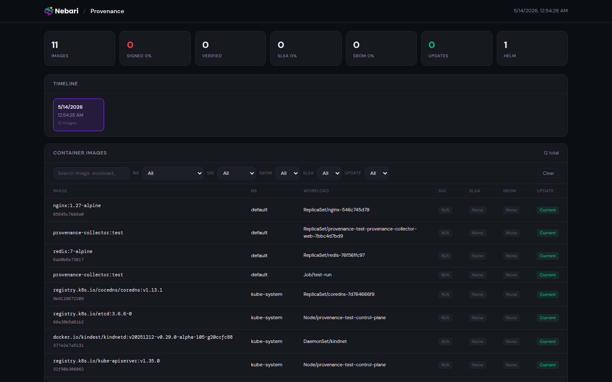
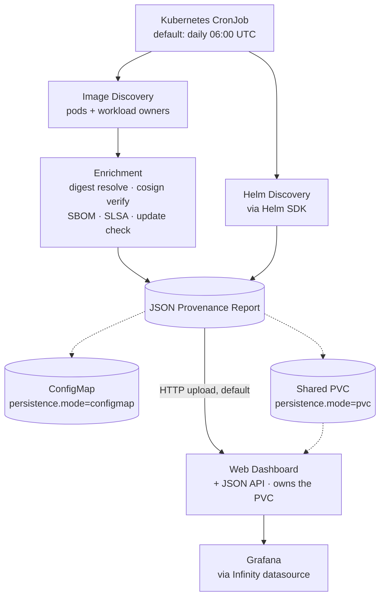

<p align="center">
  <a href="https://nebari.dev">
    <picture>
      <source media="(prefers-color-scheme: dark)" srcset="https://raw.githubusercontent.com/nebari-dev/nebari-design/main/logo-mark/horizontal/standard/Nebari-Logo-Horizontal-Lockup-White-text.png">
      <source media="(prefers-color-scheme: light)" srcset="https://raw.githubusercontent.com/nebari-dev/nebari-design/main/logo-mark/horizontal/standard/Nebari-Logo-Horizontal-Lockup.png">
      
    </picture>
  </a>
</p>

<h1 align="center">Provenance Collector</h1>

<p align="center">
  <strong>Compliance-grade provenance for every container running on your Nebari cluster.</strong><br />
  A Kubernetes-native CronJob that discovers running images and Helm releases, resolves digests, verifies
  signatures, detects SLSA provenance and SBOM attestations, checks for updates, and emits a timestamped JSON
  report (optionally surfaced via a web dashboard and Grafana).
</p>

<p align="center">
  <a href="https://github.com/nebari-dev/nebari-provenance-collector-pack/actions/workflows/test.yaml"></a>
  <a href="https://github.com/nebari-dev/nebari-provenance-collector-pack/actions/workflows/lint.yaml"></a>
  <a href="https://github.com/nebari-dev/nebari-provenance-collector-pack/actions/workflows/build-image.yaml"></a>
  <a href="https://github.com/nebari-dev/nebari-provenance-collector-pack/blob/main/LICENSE"></a>
  <a href="https://github.com/nebari-dev/nebari-provenance-collector-pack/releases/latest"></a>
  <a href="https://golang.org"></a>
</p>

<p align="center">
  <a href="#architecture">Architecture</a> &middot;
  <a href="#quick-start">Quick Start</a> &middot;
  <a href="#web-dashboard">Web Dashboard</a> &middot;
  <a href="#grafana-integration">Grafana</a> &middot;
  <a href="#configuration">Configuration</a> &middot;
  <a href="#report-format">Report Format</a> &middot;
  <a href="#development">Development</a> &middot;
  <a href="examples/">Examples</a>
</p>

<p align="center">
  
</p>

> **Status**: Under active development as part of Nebari Infrastructure Core (NIC). APIs, chart values, and report
> schema may change without notice while pre-1.0.

## What is the Provenance Collector?

The Provenance Collector is a **Nebari Software Pack** that produces compliance-grade supply-chain reports for
every container image and Helm release running on a Kubernetes cluster. It is deployed automatically by the
[Nebari Operator](https://github.com/nebari-dev/nebari-operator) as part of NIC's foundational software, runs on a
schedule as a `CronJob`, and ships each timestamped JSON report to the built-in web dashboard, a shared PVC, or a
ConfigMap — whichever `persistence.mode` is set to — so it can be surfaced via the dashboard UI, Grafana,
audit submissions, or ad-hoc `jq`.

It exists because answering *"what is actually running on this cluster, where did it come from, and is it signed?"*
should not require manual auditing.

> Curious how the pieces fit together? See the [architecture diagram](#architecture) further down.

## What It Does

| Capability | Description |
|---|---|
| **Image Discovery** | Scans all pods across namespaces, deduplicates by workload owner |
| **Digest Resolution** | Resolves every image tag to its immutable SHA256 digest |
| **Signature Verification** | Checks for cosign signatures (existence or key-based verification) |
| **SLSA Provenance** | Detects SLSA provenance attestations via OCI referrers API |
| **SBOM Detection** | Detects attached SPDX / CycloneDX attestations |
| **Update Checking** | Compares running tags against latest semver tags (configurable level, pre-release filtering) |
| **Helm Release Tracking** | Discovers all deployed Helm releases with chart versions |
| **Web Dashboard** | Optional UI with filters, sorting, pagination, and image detail panel |
| **Grafana Integration** | JSON API compatible with the Infinity datasource for dashboards and alerting |
| **Provenance Reports** | Outputs timestamped JSON reports via the dashboard's internal upload endpoint (default), a shared PVC, or a ConfigMap, with automatic retention |

## Quick Start

The Provenance Collector is normally installed by the [Nebari Operator](https://github.com/nebari-dev/nebari-operator)
as part of NIC's foundational software — you don't run any `helm` commands yourself, the operator and ArgoCD do it
for you. The operator-managed path is the supported default; the standalone install below exists for vanilla
Kubernetes clusters and local development.

### Operator-managed install (default)

A complete ArgoCD `Application` manifest lives at [`examples/argocd-application.yaml`](examples/argocd-application.yaml)
and is auto-stamped to the latest released chart version on every release. Apply it from your gitops repo or
directly:

```bash
kubectl apply -f examples/argocd-application.yaml
```

The values most users adjust:

```yaml
nebariapp:
  enabled: true                       # register the pack with the Nebari Operator
  hostname: provenance.<your-domain>  # public URL the dashboard responds on

webUI:
  enabled: true                       # default true; required when persistence.mode=http
  features:
    timelineDeltas: false             # opt-in; show +N/-N badges between scans
```

Setting `nebariapp.enabled: true` renders a `NebariApp` custom resource that registers the pack with the
[Nebari Operator](https://github.com/nebari-dev/nebari-operator). The operator wires up routing, OIDC, and
landing-page registration so the web dashboard is reachable through the Nebari gateway under
`https://<hostname>` and surfaced on the [Nebari Landing page](https://github.com/nebari-dev/nebari-landing).
Leave it `false` for clusters that aren't running the operator. Full field reference:
[docs/nebariapp-crd-reference.md](docs/nebariapp-crd-reference.md).

Verify:

```bash
# Application picked up by ArgoCD
kubectl get application provenance-collector -n argocd

# Chart unpacked: CronJob + dashboard pods exist in the target namespace
kubectl get cronjob -n provenance-system
kubectl get pods -n provenance-system -l app.kubernetes.io/name=provenance-collector
```

### Standalone install (without the Nebari Operator)

> Use this path only on a vanilla Kubernetes cluster *without* NIC. Without the operator you're responsible for
> routing and OIDC yourself if you want the dashboard reachable from outside the cluster.

#### Prerequisites

| Tool | Minimum version | Notes |
| --- | --- | --- |
| `kubectl` | 1.26+ | Cluster interaction |
| `helm` | 3.14+ | Chart install |
| Kubernetes cluster | 1.26+ | Local (kind / k3d / minikube) or remote |
| Cluster permissions | `cluster-admin` | Chart creates a `ClusterRole` + `ClusterRoleBinding` |

> If you want `nebariapp.enabled: true` on a standalone cluster, the Nebari Operator CRDs must still be installed
> first — see [docs/nebariapp-crd-reference.md](docs/nebariapp-crd-reference.md). Most standalone installs leave
> `nebariapp.enabled: false` and access the dashboard via `kubectl port-forward`.

#### Install

```bash
helm repo add nebari https://nebari-dev.github.io/helm-repository
helm repo update

helm install provenance-collector nebari/provenance-collector \
  --namespace provenance-system \
  --create-namespace
```

Or install from a local checkout when iterating on the chart:

```bash
helm install provenance-collector ./chart \
  --namespace provenance-system \
  --create-namespace
```

#### Verify

```bash
kubectl get cronjob -n provenance-system
kubectl get pods -n provenance-system -l app.kubernetes.io/name=provenance-collector
```

#### Trigger a manual run

Two options:

1. **From the dashboard** — click the `Run Scan` button next to the timeline.
   The button only renders for users whose OIDC groups intersect with
   `webUI.adminGroups`, so it's hidden by default until you wire up
   `webUI.oidcIssuer` and at least one admin group. Under operator-managed
   installs (`nebariapp.enabled: true`) this is handled automatically — the
   operator routes through Keycloak with the groups in `nebariapp.auth.groups`.
2. **With `kubectl`** — fall back to creating a Job from the CronJob directly:

```bash
kubectl create job --from=cronjob/provenance-collector \
  manual-run -n provenance-system

kubectl wait --for=condition=complete job/manual-run \
  -n provenance-system --timeout=5m
```

Either path creates a one-shot Job from the same CronJob template, so the
resulting report is identical. Manual Jobs are auto-cleaned after
`webUI.manualJobTTL` (default 1h); the kubectl-created Job above has no TTL
and persists until you delete it.

#### View the report

```bash
# Default (persistence.mode=http) — read from the dashboard.
kubectl port-forward -n provenance-system \
  svc/provenance-collector-web 8080:8080
# Open http://localhost:8080

# In another shell, fetch the latest JSON:
curl -s http://localhost:8080/api/reports/latest | jq .

# persistence.mode=configmap — no dashboard required.
kubectl get configmap provenance-report \
  -n provenance-system \
  -o jsonpath='{.data.report\.json}' | jq .
```

#### Uninstall

```bash
helm uninstall provenance-collector -n provenance-system

# Also remove the namespace (and any PVC-stored reports):
kubectl delete namespace provenance-system
```

## Storage modes

`persistence.mode` controls how reports get from the collector Job to the
dashboard. Pick one:

| Mode | What it does | Use it when |
|---|---|---|
| `http` *(default)* | Collector POSTs the JSON to the dashboard's internal Service (`{fullname}-web-internal:8081/internal/reports`, cluster-DNS only). The dashboard pod owns a single PVC; nothing else mounts it. | You're on RWO-only storage (Hetzner `csi.hetzner.cloud`, most cloud CSIs). This is the safe default. |
| `pvc` | Collector and dashboard share one PVC at `config.reportPath`. `persistence.storageClass` is required and must be ReadWriteMany-capable (Longhorn, NFS, EFS, …) unless every collector pod is guaranteed to land on the same node as the dashboard. The chart fails to render if `storageClass` is empty in this mode. | You already have an RWX-capable storage class and prefer filesystem semantics. |
| `configmap` | Collector writes the report to a ConfigMap. The dashboard is not used. | Headless / inspection-only installs. |

The internal upload endpoint is exposed through a dedicated Service
(`{fullname}-web-internal`) that the NebariApp / public Ingress never
references. Apply a NetworkPolicy restricting it to the collector
ServiceAccount if your cluster supports it.

## Web Dashboard

The collector includes an optional web UI for browsing provenance reports.

```yaml
webUI:
  enabled: true
```

Access via port-forward:

```bash
kubectl port-forward svc/provenance-collector-web 8080:8080 -n provenance-system
# Open http://localhost:8080
```

The dashboard provides:

- Summary stat cards (`N / M` ratios for Signed, Verified, SLSA, SBOM; absolute counts for Images, Updates, Helm)
- Report timeline to browse historical reports, with an opt-in `+N / -N` unique-image delta badge between adjacent scans (`webUI.features.timelineDeltas`)
- Filterable, sortable, paginated image table (sticky column header, truncated workload column with full name on hover)
- Click any image row for a detail panel showing signature, SLSA, SBOM, and update info
- Helm releases table
- **Run Scan** button — admin-gated; triggers a one-shot Job from the same CronJob template the schedule uses. Hidden unless `webUI.oidcIssuer` is set and the calling user's OIDC groups intersect with `webUI.adminGroups`. Auto-cleanup after `webUI.manualJobTTL` (default 1h).
- **Export** button (`CSV` / `Markdown` / `JSON`) — downloads whichever report is currently selected on the timeline, not just the latest

When deployed with `nebariapp.enabled: true`, the dashboard is accessible through the
Nebari gateway with OIDC authentication, and the operator wires `webUI.oidcIssuer` /
`webUI.adminGroups` from the `nebariapp.auth` block so Run Scan and other admin
features light up for users in the configured groups.

### Dashboard API

The web dashboard exposes a JSON API that can be used by external tools:

| Endpoint | Description |
|---|---|
| `GET /api/reports` | List all reports (newest first) with summary |
| `GET /api/reports/latest` | Get the most recent report |
| `GET /api/reports/<filename>` | Get a specific report by filename |
| `GET /api/export?format=csv\|markdown\|md` | Render the selected report as CSV or Markdown. Optional `&filename=<file>` to pin a historical report; defaults to latest. |
| `GET /api/me` | Calling user's identity + feature flags. Returns `authEnabled`, `canRunScan`, `features.timelineDeltas`. |
| `POST /api/scan` | Trigger a manual scan Job. 403 if the caller isn't in an admin group, 503 if `PROVENANCE_NAMESPACE` / `PROVENANCE_CRONJOB_NAME` aren't configured. |
| `GET /healthz` | Health check |

## Grafana Integration

The provenance data can be surfaced in Grafana using the
[Infinity datasource](https://grafana.com/grafana/plugins/yesoreyeram-infinity-datasource/)
plugin, which queries the dashboard's JSON API.

### Setup

1. Enable the web dashboard (`webUI.enabled: true`)
2. Install the Infinity datasource in Grafana
3. Add a datasource pointing at the dashboard service:
   - **URL:** `http://provenance-collector-web.provenance-system.svc:8080`
   - **Type:** JSON

### Example panels

**Stat panel** (unique images count):
- Type: JSON, URL: `/api/reports/latest`
- Column: `summary.uniqueImages`

**Images table**:
- Type: JSON, URL: `/api/reports/latest`, Root: `images`
- Columns: `image`, `namespace`, `signature.signed`, `provenance.hasProvenance`, `update.updateAvailable`

**Alerting** (images with updates):
```
WHEN count() OF images WHERE updateAvailable = true IS ABOVE 0
```

An example dashboard (11 panels covering unique images, signature status, SLSA provenance, Helm releases, and more) is available at [`examples/grafana-dashboard.json`](examples/grafana-dashboard.json). Import it directly into Grafana as a `dashboard.grafana.app/v2beta1` resource.

See [docs/configuration.md](docs/configuration.md) for the full Grafana setup guide.

## Configuration

All configuration is via environment variables, set through `values.yaml`:

| Variable | Default | Description |
|---|---|---|
| `PROVENANCE_NAMESPACES` | *(all)* | Comma-separated namespaces to scan |
| `PROVENANCE_EXCLUDE_NAMESPACES` | *(none)* | Namespaces to skip |
| `PROVENANCE_VERIFY_SIGNATURES` | `true` | Check cosign signatures |
| `PROVENANCE_COSIGN_PUBLIC_KEY` | *(empty)* | Path/KMS URI for cosign key |
| `PROVENANCE_CHECK_SBOM` | `true` | Check for SBOM attestations |
| `PROVENANCE_CHECK_PROVENANCE` | `true` | Check for SLSA provenance attestations |
| `PROVENANCE_HELM_ENABLED` | `true` | Discover Helm releases |
| `PROVENANCE_CHECK_UPDATES` | `true` | Check for newer image tags |
| `PROVENANCE_UPDATE_LEVEL` | `patch` | Min version bump to flag: `patch`, `minor`, or `major` |
| `PROVENANCE_SKIP_PRERELEASE` | `true` | Ignore alpha/beta/RC versions in updates |
| `PROVENANCE_REPORT_OUTPUT` | `http` | Report output: `http`, `pvc`, or `configmap` |
| `PROVENANCE_REPORT_PATH` | `/reports` | Filesystem path (dashboard pod in http mode; both pods in pvc mode) |
| `PROVENANCE_REPORT_RETENTION` | `168h` | Auto-prune reports older than this (`-1` to disable) |
| `PROVENANCE_REPORT_UPLOAD_URL` | *(set by chart)* | Dashboard upload URL used in http mode |
| `PROVENANCE_REPORT_UPLOAD_TIMEOUT` | `30s` | Timeout for the upload request in http mode |
| `PROVENANCE_REGISTRY_TIMEOUT` | `30s` | Timeout for registry operations |
| `PROVENANCE_CLUSTER_NAME` | *(empty)* | Cluster name in report metadata |

See [docs/configuration.md](docs/configuration.md) for the full reference.

## Report Format

Reports are JSON with this structure:

```json
{
  "metadata": {
    "generatedAt": "2025-01-15T06:00:00Z",
    "collectorVersion": "0.1.0",
    "clusterName": "production",
    "namespacesScanned": ["default", "monitoring"]
  },
  "images": [
    {
      "image": "nginx:1.27-alpine",
      "digest": "sha256:abc123...",
      "namespace": "default",
      "workload": { "kind": "Deployment", "name": "nginx" },
      "signature": { "signed": true, "verified": true },
      "provenance": { "hasProvenance": true, "predicateType": "https://slsa.dev/provenance/v1" },
      "sbom": { "hasSBOM": true, "format": "spdx" },
      "update": {
        "currentTag": "1.27",
        "latestInMajor": "1.27.3",
        "updateAvailable": true
      }
    }
  ],
  "helmReleases": [
    {
      "releaseName": "ingress-nginx",
      "namespace": "ingress",
      "chart": "ingress-nginx",
      "version": "4.8.0",
      "appVersion": "1.9.4",
      "status": "deployed"
    }
  ],
  "summary": {
    "totalImages": 42,
    "uniqueImages": 28,
    "signedImages": 15,
    "verifiedImages": 12,
    "imagesWithSBOM": 10,
    "imagesWithProvenance": 3,
    "imagesWithUpdates": 5,
    "totalHelmReleases": 8,
    "helmReleasesWithUpdates": 2
  }
}
```

See [docs/report-schema.md](docs/report-schema.md) for the full schema reference.

## Helm Chart Values

Key values (see `chart/values.yaml` for all options):

```yaml
schedule: "0 6 * * *"        # Daily at 6 AM UTC
config:
  namespaces: []              # Empty = all namespaces
  excludeNamespaces: []
  verifySignatures: true
  checkSBOM: true
  checkProvenance: true
  checkUpdates: true
  updateLevel: "patch"        # "patch", "minor", or "major"
  skipPrerelease: true
  reportRetention: "168h"     # 1 week, "-1" to keep forever
  reportPath: /reports

persistence:
  mode: http                  # http | pvc | configmap (see "Storage modes" above)
  storageClass: ""            # Required when mode=pvc
  size: 1Gi

webUI:
  enabled: true               # Required in http mode (hosts the upload endpoint)
  # OIDC wiring for the Run Scan button. Auto-set by the operator under
  # nebariapp.enabled=true; supply manually on standalone installs.
  oidcIssuer: ""              # e.g. https://keycloak.example.com/realms/nebari
  adminGroups: []             # OIDC group(s) allowed to click Run Scan
  manualJobTTL: "1h"          # Auto-clean dashboard-triggered Jobs; "0" to keep
  features:
    timelineDeltas: false     # Opt-in; show +N/-N badges between scans

# Nebari integration (optional)
nebariapp:
  enabled: false
```

### Private registries

When images are pulled from a private registry (e.g. Harbor, Artifactory, GHCR with a token), provide a
`docker-registry` Secret and point the chart at it. The collector will use those credentials for digest resolution,
signature lookup, SBOM detection, and update checks.

```bash
kubectl create secret docker-registry harbor-pull-secret \
  --docker-server=harbor.internal:5000 \
  --docker-username=robot \
  --docker-password=*** \
  -n provenance-system
```

```yaml
# values.yaml
registryCredentials:
  existingSecret: harbor-pull-secret
```

Air-gapped clusters and registry mirrors are tracked in
[#1](https://github.com/nebari-dev/nebari-provenance-collector-pack/issues/1).

## RBAC

The collector requires cluster-wide read access:

| Resource | Verbs | Purpose |
|---|---|---|
| `pods`, `namespaces` | get, list | Image discovery |
| `deployments`, `replicasets`, `statefulsets`, `daemonsets` | get, list | Owner resolution |
| `jobs`, `cronjobs` | get, list | Owner resolution |
| `secrets` | get, list | Helm release storage |
| `configmaps` | get, list, create, update | Report output |

## Development

```bash
# Build
make build

# Test
make test

# Lint
make lint

# Docker
make docker-build
```

### Local Testing with kind

```bash
kind create cluster
docker build -t provenance-collector:dev .
kind load docker-image provenance-collector:dev

helm install provenance-collector ./chart \
  --namespace provenance-system --create-namespace \
  --set image.repository=provenance-collector \
  --set image.tag=dev \
  --set image.pullPolicy=Never \
  --set persistence.mode=configmap \
  --set webUI.enabled=false \
  --set config.verifySignatures=false

kubectl create job --from=cronjob/provenance-collector test-run \
  -n provenance-system
kubectl logs -n provenance-system job/test-run
```

## Project Structure

```
cmd/
  provenance-collector/       Collector entry point (CronJob)
  dashboard/                  Web dashboard entry point
internal/
  config/                     Environment-based configuration
  kubernetes/                 Client factory (in-cluster + kubeconfig)
  dashboard/                  HTTP server, API handlers, HTML UI
  discovery/
    images.go                 Pod-based container image discovery
    helm.go                   Helm release discovery via Helm SDK
  registry/
    digest.go                 Digest resolution via go-containerregistry
    updates.go                Semver-based update checking
  verify/
    cosign.go                 Signature verification via cosign
    sbom.go                   SBOM attestation detection
    provenance.go             SLSA provenance detection via OCI referrers
  report/
    types.go                  Report JSON schema types
    generator.go              Orchestrator with concurrent enrichment
    writer.go                 HTTP, PVC, and ConfigMap output writers
chart/                        Helm chart (CronJob + RBAC + Dashboard + NebariApp)
examples/                     Deployment examples (standalone, Nebari, ArgoCD)
docs/                         Configuration, report schema, NebariApp CRD reference
```

## Architecture



The collector reads the Kubernetes API for inventory and the registry for enrichment, then ships the report to
the dashboard's internal upload endpoint (default), a ConfigMap, or a shared PVC depending on `persistence.mode`
(see [Storage modes](#storage-modes)). It does not push to remote services or mutate cluster state outside the
configured sink.

## Contributing

Contributions are welcome.

```bash
git clone https://github.com/nebari-dev/nebari-provenance-collector-pack.git
cd nebari-provenance-collector-pack

make build
make test
```

- [Open issues](https://github.com/nebari-dev/nebari-provenance-collector-pack/issues) — bug reports, feature
  requests, and documentation gaps.
- [Configuration reference](docs/configuration.md) — every env var and its chart value.
- [Report schema](docs/report-schema.md) — JSON output structure.
- [NebariApp CRD reference](docs/nebariapp-crd-reference.md) — operator integration fields.
- [Deployment examples](examples/) — standalone, Nebari, ArgoCD.

## License

BSD-3-Clause — see [LICENSE](LICENSE).
