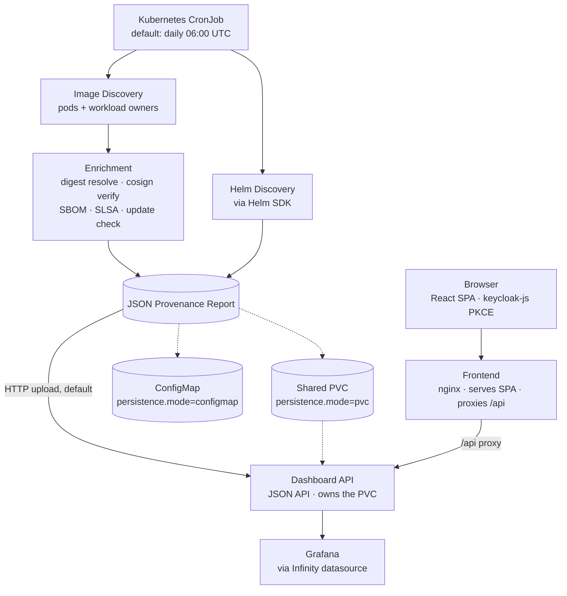

The Provenance Collector runs as a Kubernetes `CronJob` that discovers what is
running on the cluster, enriches it with supply-chain data from the container
registry, and ships a timestamped JSON report to the configured sink.

The collector reads the Kubernetes API for inventory and the registry for
enrichment, then ships the report to the dashboard's internal upload endpoint
(default), a ConfigMap, or a shared PVC depending on `persistence.mode`
(see [Storage Modes](/storage-modes/)). It does not push to remote services or
mutate cluster state outside the configured sink. The UI is served separately:
the browser loads the React SPA from the frontend nginx container, which
reverse-proxies `/api/*` to the dashboard.

## What it does

| Capability | Description |
|---|---|
| **Image Discovery** | Scans all pods across namespaces, deduplicates by workload owner |
| **Digest Resolution** | Resolves every image tag to its immutable SHA256 digest |
| **Signature Verification** | Checks for cosign signatures (existence or key-based verification) |
| **SLSA Provenance** | Detects SLSA provenance attestations via OCI referrers API |
| **SBOM Detection** | Detects attached SPDX / CycloneDX attestations |
| **Update Checking** | Compares running tags against latest semver tags (configurable level, pre-release filtering) |
| **Helm Release Tracking** | Discovers all deployed Helm releases with chart versions |
| **Web Dashboard** | Optional React + TypeScript SPA (served by nginx) with filters, sorting, pagination, and an image detail drawer |
| **Grafana Integration** | JSON API compatible with the Infinity datasource for dashboards and alerting |
| **Provenance Reports** | Outputs timestamped JSON reports via the dashboard's internal upload endpoint (default), a shared PVC, or a ConfigMap, with automatic retention |

## Learn more

- [Quick Start](/quick-start/) — install and run your first scan.
- [Storage Modes](/storage-modes/) — how reports move from the collector to the dashboard.
- [Web Dashboard](/web-dashboard/) — the UI, its JSON API, and Grafana integration.
- [Report Schema](/report-schema/) — the JSON output structure.
